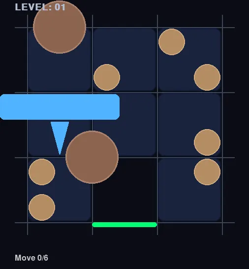

# Asteroid Escape Solver

An automated solver and graphical interface for the **"Asteroid Escape"** puzzle by **SmartGames**. (I highly recommend buying one physical copy!)

## About the project

Mostly a vibe coding project. I implemented the board logic with unit-based collision detection, then added a BFS solver, a Pygame visualizer, and an interactive level editor.

Currently this is considered done as all 60 main puzzles are solved.

You can find all questions (in ascii format) in `questions/` folder and solutions (webp animation) in `solutions/` folder.

There are 60 main levels across 5 difficulty levels.

Below is a sample solution webp for the first puzzle.

## Rules & Useful links
Here's the designer's webpage introduction on this game which also explains the rules:
https://www.smartgamesandpuzzles.com/asteroid-escape.html

Due to copyright, I will not show any instruction or booklet, but you can download them for free here if you are interested: https://www.smartgames.eu/uk/one-player-games/asteroid-escape#downloads

# == Everything below are generated ==

## Project Overview

This project provides a complete suite of tools to model, solve, and visualize the Asteroid Escape sequential movement puzzle. It includes an optimized BFS solver, a graphical user interface for playback, an interactive manual player, a level editor, and batch export capabilities.

## Executables & Commands

### 1. Solver UI (`solver_ui.py`)
Finds the shortest sequence of moves and visualizes the solution.
- **Run with playback:** `python3 solver_ui.py 01`
- **Run with Autoplay:** `python3 solver_ui.py 01 --autoplay`
- **Hide Controls:** `python3 solver_ui.py 01 --no-controls`

### 2. Interactive Player (`play.py`)
Manually play through any level with an optional hint system.
- **Usage:** `python3 play.py 01`
- **Controls:**
  - **Arrow Keys:** Move pieces adjacent to the empty spot.
  - **'H' Key:** Hint - calculates and executes the next optimal move via solver subprocess.
  - **'R' Key:** Reset the level.
  - **'ESC' Key:** Quit.

### 3. Level Editor (`level_editor.py`)
Create or modify puzzle levels using a mouse-driven interface.
- **Usage:** `python3 level_editor.py 32`
- **Controls:** 
  - **Left Click:** Drag piece on board / Select from sidebar.
  - **Right Click:** Remove piece from board.
  - **'R' Key:** Rotate piece (while dragging).
  - **'S' Key:** Save to `questions/XX.txt`.
  - **ESC:** Quit without saving.

### 4. Edit and Solve Script (`edit_and_solve.sh`)
Streamlined workflow to edit a level and immediately see its solution.
- **Usage:** `./edit_and_solve.sh 32`

### 5. Batch Exporter (`batch_export.py`)
Automatically exports all missing solutions to animated WebP files in parallel.
- **Usage:** `python3 batch_export.py -p 10`
- **Flag:** `-p` sets the level of parallelism (default: 10).

## Core Components

- **`board.py`**: The underlying engine that handles piece geometry and unit-based collision detection (3x3 units per tile).
- **`board_io.py`**: Handles parsing and serialization of the ASCII puzzle format.
- **`solver.py`**: Core BFS implementation for finding the shortest path to the exit.
- **`visualizer.py`**: Shared Pygame rendering module for smooth animations and consistent visuals.

## Technical Highlights
- **Unit-Based Collision**: Implements a high-resolution grid within each tile to handle complex piece shapes and validate sliding paths during transitions.
- **Optimized BFS**: Guaranteed shortest-path discovery using state hashing to manage the search space.
- **Subprocess Hint System**: The player integration leverages the CLI solver as a separate process for non-blocking hint calculations.
- **Multi-threaded Export**: Uses `ThreadPoolExecutor` to maximize throughput when generating high-quality WebP animations.
